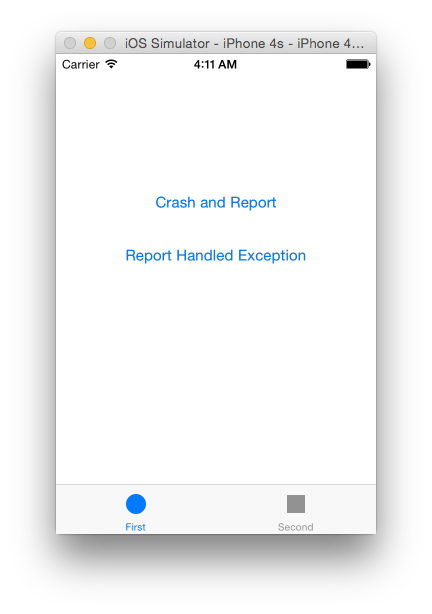

# Drop-in iOS Crash Analysis with HP AppPulse Mobile


<!--- Motivation - Explain why crash analysis is critical to monitor in mobile apps, how it’s not possible to cover all use cases and device/OS matrix during testing.

- Why crash log isn’t enough – Describe example or two of crashes that their root cause is hard to understand just by crash logs. For example, crashes that are related to the activity or fragment lifecycle. The point should be that in many cases you need to know what

- Describe automatic crash trail by AppPulse Mobile – Explain how it solves the problem of the previous example.

- SDK breadcrumbs API – Say that automatic crash trail is great for most cases but sometimes there’s a need to see internal data that is only known in the context of the app (e.g. – server to which is it connected)
-->

v0.3

---

(plan)

- intro
- creating buggy app with Xcode and Swift
- registering AppPule accouny
- adding AppPulse to the project
- viewing the reports, email notifications
- conclusion
- breadcrumbs api
- e2e flow and JIRA integration


---

## Why?

Every developer strives to write his code in a best possible manner and avoid bugs before they ship to end-user device. However in reality the only bug-free software is the one that doesn't exist.

Some issues are caused by errors in application code and can be cought with extensive testing, while others can occure only due to some very specific combination of device/carrier/usage scenario/whatever. The best thing to catch those – is to essentially turn end-user device into your test rig. Sounds like testing in production, but with billions devices out there, since your app crashes anyway, it's better to at least know why.

One may ask: _"Why adding another library that automates crash reporting? When something happens I will just ask my users to shoot me an email describing what they did and what buttons they tapped."_

The thing is when 100 users experience an error only 1 may be willing to get into trouble writing an actual report. Other may just silently uninstall an app or, worse, give it a one-star rating before doing so. So it's critical to be informed about the error before there is a critical mass of disappointed users.

Now imagine there is a drop-in solution that can provide you with all the neccessary information in an event of an error – the device type, OS version, what user actions led to an error, etc. [HP AppPulse Mobile](http://www8.hp.com/us/en/software-solutions/apppulse-mobile-app-apm-monitoring/) is exactly that. With AppPule Mobile every error or crash actually helps you to improve your application.

This tutorial shows how you can add HP AppPulse support into your application and what are the benefits you get.

## Why AppPulse Mobile?

While there are lotf of crash reporting instruments out there there are few features unique to AppPulse Mobile:

- AppPulse Mobile automatically mathces user actions to crash/error events making it easier to trace what exactly led to it.

- Unique Breadcrumbs API that allows to attach meta information to reports.

- Integration with JIRA for the tracking and rapid response to revealed issues.

With that said, AppPulse Mobile is perfect choice for the enterprise mobile applications.

## Creating a Buggy iOS Application

Clone a repository from [https://github.com/myurasov/HP-AppPulse-Mobile-iOS-Crash-Reporting/](https://github.com/myurasov/HP-AppPulse-Mobile-iOS-Crash-Reporting/):

```
$ git clone -d app-template https://github.com/myurasov/HP-AppPulse-Mobile-iOS-Crash-Reporting.git myapp
$ open -e myapp/Crashy.xcodeproj
```

Main view looks like this:



The app template already has action outlets defined for the buttons on one of the tabs.

Open __FirstViewController.m__ in the code editor and add the following snippet:

```
- (void)throwCustomException {
    @throw [[NSException alloc] initWithName:@"Custom" reason:@"Testing" userInfo:nil];
}
```

It creates an exception with our custom message and throws it. Now if you add the following code:

```
[self throwCustomException];
```

to both _onButton1Tap_ and _onButton2Tap_ methods, the application (when deployed to end-user device) will just silently crash on either button press without letting anyone knowing why it crashed. Let's solve this problem in the next part by adding HP AppPulse Mobile to our project.


## Adding AppPulse Mobile to Your Project

### Adding the SDK

The process of adding AppPulse Mobile is pretty-straightforward:

* Go to [http://www8.hp.com/us/en/software-solutions/apppulse-mobile-app-apm-monitoring/index.html](http://www8.hp.com/us/en/software-solutions/apppulse-mobile-app-apm-monitoring/index.html) and start your free trial.

 
* Make sure AppPule Mobile is enabled in your HP SAAS control panel at [https://home.saas.hp.com/myaccount/#/myProducts](https://home.saas.hp.com/myaccount/#/myProducts).


* Press + to create a new iOS application. Enter your application name and the modal window with a detailed instruction will pop up. Make sure you download and add the AppPulsemobile framework to your project and set the _AppId_ parameter in __hprunmonitor.plist__.

Bingo! Now when you launch your application you should see something like the following message in your Xcode console area:


Congratulations, you now have access to the usage statistics and performance metrics without writing a single line of code.


Let's learn how we can use HP AppPulse Mobile to benefit from it's error and crash reporting capabilities.

### Crash Reporting

In order to use HP AppPulse Mobile SDK in your application you need to import the header file. Add the following snippet to your __FirstViewController.m__ file:

```
#import <AppPulseMobile/HPAppPulse.h>
```

Now the __HPAppPulse__ object is available for our use.

Let's navigate to the __onButton1Tap__ method and add the following code to it:

```
@try {
    [self throwCustomException];
}
@catch (NSException *ex) {
	[HPAppPulse reportCrash: ex];
    exit(1);
}
```

Here we are using __reportCrash__ API call to upload information about an unrecoverable error.

Add the following code to the __onButton2Tap__ to enable error generation:

```
[HPAppPulse addBreadcrumb:@"BREADCRUMB at button tapped"];

@try{
    [self throwCustomException];
}
@catch (NSException *ex){
    [HPAppPulse reportHandledException: ex];
}
```

The __addBreadcrumb__ call add the so-called bradcrumb to your report. Breadcrumb is essentially a piece of metadata you would like to see when you are troubleshooting the issue, such as a value of some variable, network connection state, etc.

The __reportHandledException__ method is used to uppload errors that can be recovered and do not lead to an app termination.

Launch your application either in sumulator or on device and try playing with two buttons seen on the first screen.

## Viewing the Reports

To view your reports on errors and crashes, go to the __Stability__ page in your AppPulse Mobile control panel.

The Stability overview page now has the information on captured crashes, errors and uswer actions that led to a problem:


Every error and crash entry can be expanded to view more information:


## JIRA Integration and E2E Flow

## Conclusion


